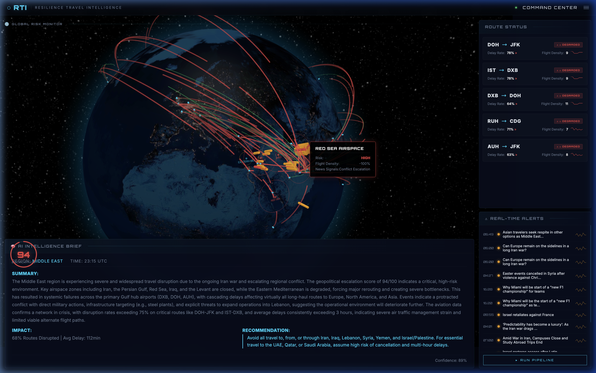

# RTI (Resilience Travel Intelligence) — Command Center



## Overview
RTI is a high-fidelity, real-time geopolitical and aviation risk dashboard. It is designed for corporate travel resilience, providing security teams with situational awareness during regional conflicts and aviation disruptions.

The system monitors live flight patterns, aggregates global news signals (via API and RSS), and uses a multi-layered AI reasoning engine to generate actionable intelligence briefs.

## Key Features
- **3D Geospatial Monitoring**: Interactive globe visualizing risk zones, flight corridors, and real-time aircraft density.
- **Multilayered Reasoning Agent**: A 2-pass AI analysis pipeline that uses low-cost models for extraction and triggers deep reasoning only when escalation scores peak.
- **Real-Time Data Pipeline**: WebSockets provide instant updates from the orchestrator to the dashboard with zero-latency broadcasting.
- **Cost-Optimized Backend**: Multi-tier caching (Memory + SQLite) and stale-while-revalidate logic reduce API costs and LLM token consumption.
- **Aggregated Intel**: Fusion of GDELT, NewsAPI, OpenSky, AviationStack, and curated RSS feeds (BBC, Al Jazeera, NYT, Google News).

## System Architecture

### Backend (FastAPI + Python)
- **Orchestrator**: Manages the DAG (Directed Acyclic Graph) of agents, ensuring efficient execution and caching.
- **Analyst Agent**: The brain of the operation. Uses a structured approach to evaluate geopolitical impact on travel.
- **GeoIntel Agent**: Scans news and RSS feeds, tagging regions and estimating sentiment/tone.
- **Aviation Agent**: Monitors specific flight corridors and airport hubs, simulating metrics under data-sparse conditions.

### Frontend (HTML5 / Vanilla JS / Three.js)
- **Globe.gl API**: Powers the 3D visualization and jet silhouette animations.
- **WebSocket Client**: Handles real-time telemetry and intelligence brief updates.
- **Modular CSS**: Premium dark-mode aesthetic with glassmorphism and responsive typography.

## Setup & Installation

### 1. Requirements
- Python 3.9+
- Node.js (Optional, for front-end dev)
- API Keys (see below)

### 2. Environment Configuration
Create a `.env` file in the root directory:
```env
# Core API Keys
OPENAI_API_KEY=sk-...           # OpenAI, DeepSeek, or Local Key
NEWSAPI_KEY=...                  # from newsapi.org
AVIATIONSTACK_KEY=...            # from aviationstack.com

# Model & Provider Configuration
LLM_BASE_URL=https://api.openai.com/v1   # Default
# For DeepSeek, use: https://api.deepseek.com
# For Local (Ollama), use: http://localhost:11434/v1

DEFAULT_MODEL=gpt-4o            # Deep reasoning (e.g., deepseek-chat)
FAST_MODEL=gpt-4o-mini          # Fast extraction (e.g., deepseek-coder)
ESCALATION_THRESHOLD=50
```

### 3. Getting API Keys
- **DeepSeek**: Get your key at [platform.deepseek.com](https://platform.deepseek.com/). Highly recommended for cost-effective reasoning.
- **Local Models**: RTI supports any OpenAI-compatible API. You can run **Llama 3** or **Mistral** locally via [Ollama](https://ollama.com/) or **vLLM**. Just set the `LLM_BASE_URL` to your local endpoint.
- **NewsAPI**: Register at [newsapi.org](https://newsapi.org/). Provides world news headlines.
- **AviationStack**: Register at [aviationstack.com](https://aviationstack.com/). Provides real-time airport/flight status.
- **OpenAI**: Get your key at [platform.openai.com](https://platform.openai.com/).
- **RSS/GDELT**: No keys required. These are accessed via public feeds.

## Usage
Start the integrated server:
```bash
python run.py
```
Open your browser to:
`http://localhost:8000/static/index.html`

## Design Aesthetic
The dashboard uses a "Midnight Void" theme with teal accents (`#00d8ff`) and high-contrast alert states (Amber/Red). Typography uses **Orbitron** for a futuristic command-center feel and **Inter** for high-density information readability.
